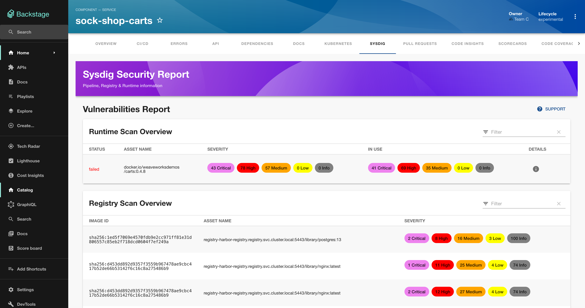
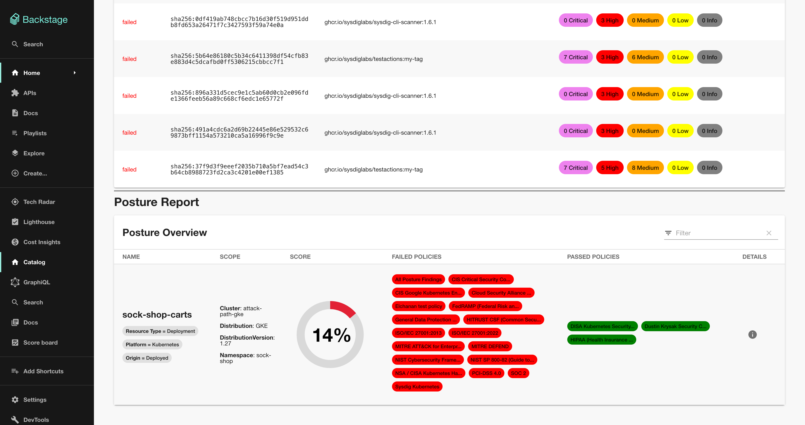

# Sysdig Plugin for Backstage


Welcome to the official Sysdig Plugin for Backstage. This plugin will show you the latest Vulnerabilities and Posture reports of your services using Sysdig Secure.




## Pre-requisites

For this plugin to work, you will access to Sysdig Secure.

You must provide:

- Your **Sysdig Secure API Key**.
- Your **Sysdig Secure Endpoint** (region for SaS).

Please refer to the [official documentation](https://docs.sysdig.com/en/docs/administration/saas-regions-and-ip-ranges/) for more details.

## Getting started


### Install the package

#### Via NPM

TBA

<!-- ```bash
# From your Backstage root directory
yarn --cwd packages/app add @sysdig/backstage-plugin-sysdig
``` -->

#### Via GitHub

```bash
# From your Backstage root directory
git clone https://github.com/sysdiglabs/backstage-plugin-sysdig -o plugins/sysdig
yarn install
```

### Add the route

Add the **Sysdig page** to the Entity routes in `packages/app/src/components/catalog/EntityPage.tsx`:

```diff
+ import { SysdigPage } from '@sysdig/backstage-plugin-sysdig';

...


const serviceEntityPage = (
  <EntityLayoutWrapper>

  ...

+    <EntityLayout.Route path="/sysdig" title="Sysdig">
+      <SysdigPage />
+    </EntityLayout.Route>

  ...

  </EntityPageLayout>
)
```

### Add the Sysdig connection settings

Edit `app-config.yaml` and add to the API endpoints the following details:

```diff
proxy:
  endpoints:
+     '/sysdig':
+       target: 'https://secure.sysdig.com/'
+       changeOrigin: true
+       allowedMethods: ['GET']
+       headers:
+         "Authorization": "Bearer ${SYSDIG_SECURE_TOKEN}"
+         "Content-Type": "application/json"
+         "Accept": "application/json"
+         "X-Sysdig-Product": "SDS"
```

Replace the value for `target` with your Sysdig Secure Endpoint.

You can replace `${SYSDIG_SECURE_TOKEN}` with your Sysdig Secure API Token, or you can set it to the `SYSDIG_SECURE_TOKEN` environment variable when deploying your Backstage instance.


## How to annotate services

All added annotations are available and documented in the [source file](./src/lib/annotations.ts).

Be aware that not all annotations are needed, the different reports may or may not work depending on which information is provided. For example, to get Registry scanning results, you will need to annotate the corresponding services with registry data.

### Example

```yaml
apiVersion: backstage.io/v1alpha1
kind: Component
metadata:
  name: sock-shop-carts
  annotations:
    # VM Runtime
    sysdigcloud.com/kubernetes-cluster-name: sock-shop-cluster
    sysdigcloud.com/kubernetes-namespace-name: sock-shop
    sysdigcloud.com/kubernetes-workload-name: sock-shop-carts
    sysdigcloud.com/kubernetes-workload-type: deployment

    # VM Registry
    sysdigcloud.com/registry-vendor: harbor
    sysdigcloud.com/registry-name: registry-harbor-registry.registry.svc.cluster.local:5443

    # VM Pipeline
    sysdigcloud.com/image-freetext: ghcr.io/sysdiglabs
    
    # Posture
    sysdigcloud.com/resource-name: sock-shop-carts
    sysdigcloud.com/resource-type: "Deployment"
  description: |
    This is the Sock shop service that keeps track of socks pairs to be purchased.
spec:
  type: service
  lifecycle: experimental
  owner: team-c
  system: sock-shop
  dependsOn:
    - component:default/sock-shop-carts-db

```


## FAQs

### I already have my Backstage components tied to Kubernetes (or other) annotations. Can I use those?

In most cases, **no**. It cannot be guaranteed that values for other plugins, such as the Kubernetes one, will match those in Sysdig. For example, when you install the Sysdig Agent, you can set data to whatever you want (such as the cluster name), so it may differ from what other plugins have.

If you can guarantee that values for certain annotations will always match across plugins, you can edit the [source file](./src/lib/annotations.ts) and set those to the desired annotations.